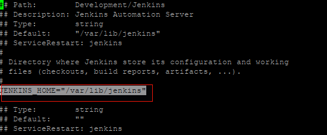
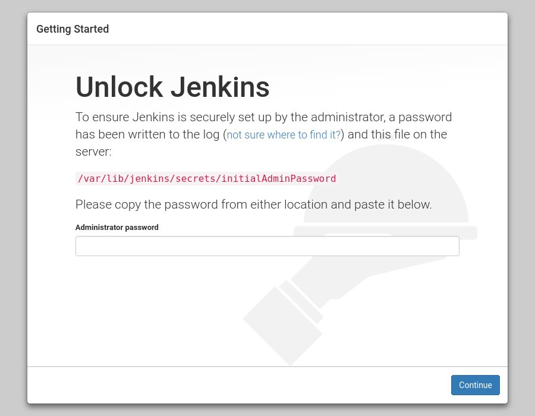
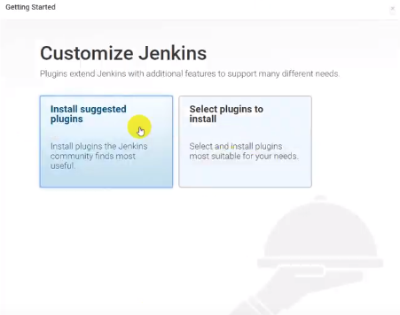
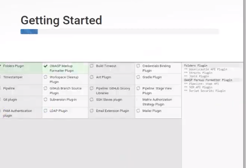
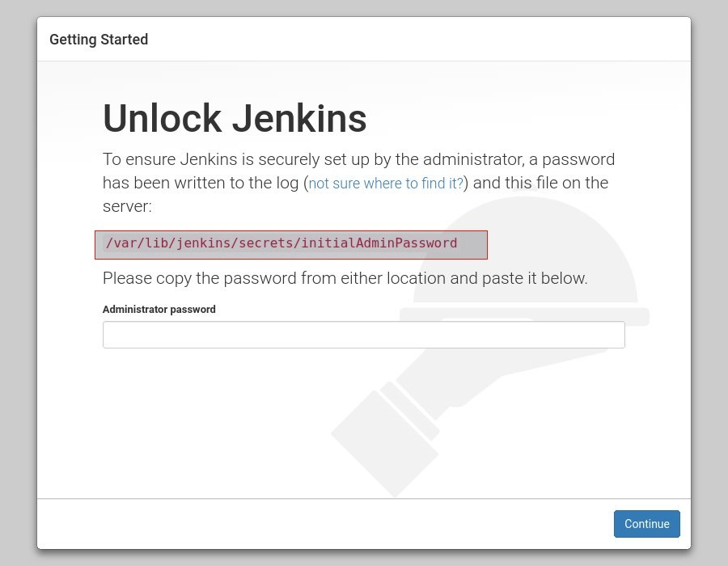
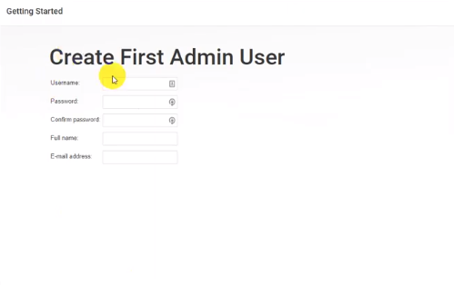

## Mục Lục

### [1. Tổng quan jenkins ](#1)

### [2. Cài đặt jenkins](#2)
    
   - [2.1 Cấu hình jenkins](#2.1)
   
   - [2.2 Cài đặt 1 vài plugin cần thiết](#2.2)
   
   - [2.3 Tạo User, quản lý Role cho các User](#2.3)
   
   - [2.4 Tạo và cấu hình Job](#2.4)
   
   - [2.5 Kết hợp Jenkins với GIT, Automated Deployment, Alert mail](#2.5)
   
### <a name="1"><a/>1 Tổng quan jenkins

Jenkins là một phần mềm tự động hóa, mã nguồn mở và viết bằng Java. Dự án được tách ra từ dự án ban đầu là Hudson, sau khi xảy ra sự tranh chấp với Oracle.

Jenkins giúp tự động hóa các quy trình trong phát triển phần mềm, hiện nay được gọi theo thuật ngữ Tích hợp liên tục, và còn được dùng đến trong việc Phân phối liên tục. Jenkins là một phần mềm dạng server, chạy trên nền servlet với sự hỗ trợ của Apache Tomcat. Nó hỗ trợ hầu hết các phần mềm quản lý mã nguồn phổ biến hiện nay như Git, Subversion, Mercurial, ClearCase... Jenkins cũng hỗ trợ cả các mã lệnh của Shell và Windows Batch, đồng thời còn chạy được các mã lệnh của Apache Ant, Maven, Gradle... Người sáng tạo ra Jenkins là Kohsuke Kawaguchi.[3]. Phát hành theo giấy phép MIT nên Jenkins là phần mềm miễn phí.[4]

Việc kích hoạt build dự án phần mềm bằng Jenkins có thể được thực hiện bằng nhiều cách: dựa theo các lần commit trên mã nguồn, theo các khoảng thời gian, kích hoạt qua các URL, kích hoạt sau khi các job khác được build,...
 
### <a name="2"><a/>2 cài đặt jenkins centos7

**Prerequisites**

Minimum hardware requirements:

256 MB of RAM

1 GB of drive space (although 10 GB is a recommended minimum if running Jenkins as a Docker container)

Recommended hardware configuration for a small team:

1 GB+ of RAM

50 GB+ of drive space

Software requirements:

Java: see the Java Requirements page

Web browser: see the Web Browser Compatibility page

- Trước khi cài jenkin, cần phải cài java vì jenkins chạy trên nên java

yum install java-1.8.0-openjdk-devel

- enable jenkins repo và import GPG key sử dụng lệnh curl

curl --silent --location http://pkg.jenkins-ci.org/redhat-stable/jenkins.repo | sudo tee /etc/yum.repos.d/jenkins.repo

- add repo vào hệ thống

rpm --import https://jenkins-ci.org/redhat/jenkins-ci.org.key

- install jenkins

yum install jenkins

- sau khi cài đặt xong, nếu muốn thay đổi thư mục home mặc định của jenken cần chỉnh lại file config

vi /etc/sysconfig/jenkins

thay vào đó là thư mục mới VD: JENKINS_HOME="/data" (hãy chắc chắn trong máy của bạn đã có thư mục data)

- start và enable jenkins

systemctl start jenkins && systemctl enable jenkins

- reboot lại hệ thống

reboot 

- Nếu firewall của bạn đang bật thì hãy mở port bằng lệnh sau.

firewall-cmd --permanent --zone=public --add-port=8080/tcp

firewall-cmd --reload

#### <a name="2.1"><a/> 2.1 Cấu hình jenkins

    http://your_ip_or_domain:8080
   

bạn sẽ có 1 giao diện web như hình.

lấy password jenkins random để đăng nhập

cat /var/lib/jenkins/secrets/initialAdminPassword

nếu biết mình cần cài nhưng plugin nào thì bạn chọn SELECT PLUGIN, còn nếu ko biết thì chọn INSTALL SUGGESTED

quá trình cài đặt plugin bắt đầu.

_**_chú ý nếu bạn đã thay đổi thư mục home của jenkins trong /etc/sysconfig/jenkins_ thì đường đã sẽ khác hãy đọc ở màn hình đăng nhập của jenkins**_

sau khi login bằng password có được từ file initialAdminPassword, nó sẽ biến mất và bạn sẽ được chuyển đến trang tạo user.

nhập đầy đủ các thông tin tài khoản

quá trình cài đặt jenkins đã hoàn tất.

### <a name="2.2"><a/> 2.2 Cài đặt 1 vài plugin cần thiết
	
Role-based Authorization Strategy (dùng để phần quyền cho từng jobs)

Email Extension Template Plugin (dùng để gửi mail sau khi buil vào deploy)

Promoted Builds (dùng để đánh dấu các phiên bản buil khá có ích khi muốn revert lại các bạn build)

   http://jenkins.local:8080/pluginManager/
   

- nhập plugin cần cài vào ổ tìm kiếm.

- tích vào plugin cẩn cài 

- click vào install without restart để cài đặt

cài đặt xong plugin muốn restart lại jenkins 

    http://jenkins.local:8080/restart
    
chọn yes

### <a name="2.3"><a/>2.3 Tạo User, quản lý Role cho các User

http://jenkins.local:8080/securityRealm/addUser

**phân quyền**

từ memu chính chọn  Manage Jenkins >> Configure Global Security >> Project-based Matrix Authorization Strategy

http://jenkins.local:8080/configureSecurity/

### <a name="2.4"><a/>2.4 Tạo và cấu hình Job

Từ menu chính chọn **New Item**

1 trang mới sẽ hiện ra

nhập tên cho jobs và chọn type rồi click ok

tab general

Như đã nói ở trên phần này mình sẽ nhắc đền **Project role**

như trong hình mình đã add user 1 và cho user này có quyền buil cancel và workspace (tạo tác với thư mục workspacs)
click vào Add buil step chọn Execute Shell

trong phần Shell mình thực hiện 2 lệnh đơn giản.

touch jenkins.txt (tạo ra file jenkins.txt)

ls $WORKSPACE       (hiển thị nội trong trong thư mục $WORKSPACE  )

vì sao lại có  $WORKSPACE, bạn có thể xem trong **See the list of available environment variables** ngay phía dưới phần command

click save 

công việc tạo jobs đã xong

giờ sẽ chạy thử bằng user1 đã phần quyền ở phía trên
Kết quả

như vậy là build thành công.

giờ chúng ta nâng cao lên 1 chút đó là cấu hình buil và deploy từ github

### <a name="2.5"><a/>2.5 Kết hợp Jenkins với GIT && Automated Deployment && alert mail

Trước khi bắt đầu bạn cần cài đặt git plugin (nếu chưa có)

cài đặt plugin Publish over SSH 

cách cài đặt mình đã hướng dẫn ở trên.

Cấu hình phần alert mail

Tại menu chính Manage Jenkins >> Configure System >> Extended E-mail Notification

SMTP server : server mail

Default user E-mail suffix : dạng tên miền của mail

Tích vào use SMTP Auth 

User Name: địa chị mail

password: mật khẩu mail

reply to list: nhập lại địa chị mail ở trên.

**chú ý:** nếu ban dùng gmail hoặc gsuite thì hãy cho phép tài khoản đăng nhập vào ứng dụng kém an toàn

cuộn chuột xuống cuối tìm đến phần  **Publish over SSH**

cấu hình Publish over SSH  để deploy lên server.

Tại phần SSH Servers

Nhập các thông tin của server cần deploy

Name: bạn nhập gì cũng được (để gợi nhớ đến server)

Hostname: nhập ip hoặc hostname

username: mặc định là jenkins (hãy chắc chắn rằng user jenkins đã được tạo ở server ssh)

Remote Diretory: đây là nơi jenkins sẽ deply code (hãy chắc chắn server ssh có thư mục này)

Tích Use password authentication, or use a different key

Patch to key là đường dẫn đề file key ssh private

/var/lib/jenkins đây là thư mục home mặc địch của jenkins

/.ssh/id_rsa.ppk thư mục .ssh là mình tạo ra để cấu hình cho dễ quản lý

nếu bạn ko muốn phúc phạp vấn đề bạn có thể paste trực tiếp key private và mục **Key** ngay bên dưới patch to key

sau khi cấu hình xong hãy click vào **test config**  ở góc bên phải. nếu có thông báo **success** thì cấu hình xong. nếu ngược lại thì các bạn biết phải làm gì rồi đó :D

cuối cùng là **SAVE** 

vậy là cấu hình xong alertmail và ssh

giờ đến cấu hình jobs

Add Parameter >> git Parameter 

Name: nhập bất cứ cái gì bạn muốn
 
Parameter Type: sẽ buil từ branch (mặc định là master nếu git của bạn cảu nhiều brach)
 

**Source Code Management**

Repository URL: là địa cảu git server bạn muốn pull (để đây mình dùng clone qua ssh nên sẽ cấu hình Credentials, nếu bạn clone từ http thì ko cần)

Branch Specifier (blank for 'any') : $BUILD gọi đển biến **Name** bạn vừa đặt ở phần **git Parameter**

**Build Triggers**

Build when a change is pushed to BitBucket. ý nghĩ của nó là mỗi khi có commit thì jenkins sẽ từ động buil và deploy

**_chú ý: muốn sử dụng tính này năng thì bạn cần cấu hình webhook trên github và server jenkins của bạn phải được public ra ngoài.**_

tham khảo cấu hình webhook:

https://dzone.com/articles/adding-a-github-webhook-in-your-jenkins-pipeline

**Build Environment**

Send files or execute commands over SSH before the build starts 

Send files or execute commands over SSH after the build runs

Tên của 2 tùy chọn này cũng đã nói lên cách nó làm việc rồi

gửi file hoặc thực hiện lên shell trước khi build. tức là lệnh shell sẽ được thực thi trước khi clone code từ gitserver về và ngược lại

**SSH Publishers**

- SSH server sẽ list và các server ssh mà bạn đã cấu hình trong phần **Publish over SSH** ở trên. nếu bạn cấu hình nhiều server ssh thì hãy chọn chính xác.

- Transfers     Source files: là thư mục chứa code clone từ git về mặc địn là **workspace** (các bạn có thể tìm hiểu thêm về workspaces tại http://jenkins.local:8080/env-vars.html/ )
- Remote directory: là thư mục bạn đã cấu hình ở phần **Publish over SSH**

- Exec command : thực hiện lệnh shell gì đó. VD ở đây show ra nội dung của thư mục Remote directory chính /producs/hanv

**Post-build Actions**

chọn Editable Email notification

Project Recipient List : nhập vào địa chỉ email nhập thông báo sau khi build

Attach Build Log : chọn Attach Build Log để đính kèm chi tiết log quá trình build và deploy.

click vào **Advance Setting** bên góc phải 

tìm đến 	**Triggers** bên góc trái chọn **Add Trigger** chọn tiếp **Always** xóa **Developer** đi chỉ để **Recipient list**

cuối cùng là **SAVE**

Vậy là đã cấu hình hoàn tất giờ chạy buil để test thành quả thôi. :D

Tài liệu tham khảo: https://vi.wikipedia.org/wiki/Jenkins_(ph%E1%BA%A7n_m%E1%BB%81m)

 

